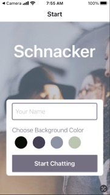
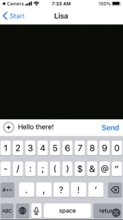
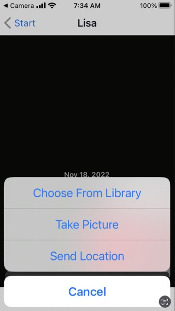
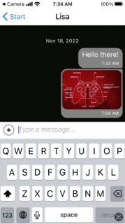
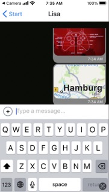

# Schnacker Chat Project

## Objective:
To build a chat app for mobile devices using React Native. The app will provide users with a chat interface and options to share images and their location.

## Images:
Start screen and basic input:



Features menu, photo and location messaging:




## Key Technologies: 
* React, React-Native - Front End Framework
* Expo, Android Studio - Development
* Firebase Firestore - Cloud Storage and NoSQL Database

## Key Features: 
* A landing page where users can enter their name and choose a background color for the chat screen before joining the chat.
* A main chat page displaying messages, the input field and submit button. 
* The chat provides users additional communication features: taking and sending images and sending location data. 
* Data gets stored online and offline. 
* The app provides accessibility features so those with visual impairments can understand and use the app.

## User Stories and Scenario Tests
As a user, I want to:
* Easily enter the chat room so I can quickly start talking to my friends and family.
* Send messages to my friends and family members to exchange the latest news.
* Send images to my friends to show them what I’m currently doing.
* Share my location with my friends to show them where I am. 
* Read my messages offline so I can reread conversations at any time. 

As a user with a visual impairment, I want to:
* Use a chat app that is compatible with a screen reader so that I can engage with a chat interface.

## Run this project
The Schnacker Chat App was developed using [Expo](https://docs.expo.dev/) and can be run on iOS or Android mobile devices or simulators like [Android Studio](https://developer.android.com/studio/install). It utilizes [Google Firebase](https://firebase.google.com/) to store chat data. See more information here on [Firebase Firestore](#create-your-own-database-with-firebase) set-up. 

1. Follow the documentation to install Expo on your device or a simulator on Windows, Mac or Linux. 

2. Clone Schnacker from Github using the URL or Github CLI:
```
git clone https://github.com/Nekomimi-YT/Schnacker.git
```
```
gh repo clone Nekomimi-YT/Schnacker
```

3. Install the Expo CLI and npm [project dependencies](#project-dependencies) in the project's root folder:
```
npm i -g expo-cli
npm install
```

4. Run the project:
```
expo start
```
Follow the instructions in the terminal to connect to Android or iOS or scan the QR code.  

### Project Dependencies
```
"@react-native-async-storage/async-storage": "~1.17.3",
"@react-native-community/masked-view": "^0.1.11",
"@react-native-community/netinfo": "9.3.0",
"@react-navigation/native": "^6.0.13",
"@react-navigation/stack": "^6.3.2",
"expo": "~46.0.16",
"expo-status-bar": "~1.4.0",
"firebase": "^7.9.0",
"react": "18.0.0",
"react-native": "0.69.6",
"react-native-action-sheet": "^2.2.0",
"react-native-gesture-handler": "~2.5.0",
"react-native-gifted-chat": "^1.0.4",
"react-native-reanimated": "~2.9.1",
"react-native-safe-area-context": "4.3.1",
"react-native-screens": "~3.15.0",
"react-navigation": "^4.4.4",
"expo-location": "~14.3.0",
"react-native-maps": "0.31.1",
"expo-permissions": "~13.2.0",
"expo-image-picker": "~13.3.1"
```
### Create your own database with Firebase
1. Sign in to [Google Firebase](https://firebase.google.com/) with Google and, if you don't have one already, create a new Firebase account. 
2. Go to the console via the link in the top-right corner of the window.
3. Click on Create Project (or Add project if you've already worked with Firebase). 
4. In the form, name your project.  Leave the default settings, agree to the term and click on Create Project. 
5. Create your database by clicking Develop from the menu on the left-hand side. Select Cloud Firestore and Create Database. 
6. Start in test mode and then select a location for Cloud Firestore that is nearest to you.  Firestore will automatically configure and load the database page.
7.  In the main panel, click on Start collection and add a new collection called "messages".  Insert some dummy data to get started. 
8.  Click on the Settings icon at the top of the left-side menu, next to Project Overview.  Choose Project Settings.
9.  Scroll down to SDK Setup and Configuration.  Be sure the npm option is chosen.  Copy your Firebase configuration from the code.  It should look something like this:
```
// Your web app's Firebase configuration
const firebaseConfig = {
  apiKey: "ABcdefg1234-Zb2Q763433X9GXmGHStVKsLJdccv",
  authDomain: "example-firestore-7d5wq.firebaseapp.com",
  projectId: "example-firestore-7d5wq",
  storageBucket: "example-firestore-7d5wt.appspot.com",
  messagingSenderId: "123456780123",
  appId: "1:123456780123:web:a12345d66fb1234ff0985e"
};
```
10. Paste this code over lines 29-36 in Chat.js to connect your database. 